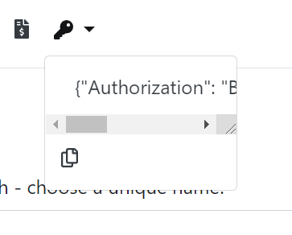
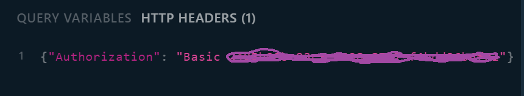

# Finding your API Key

The API is accessed independently from the rest of the site.

Once you are logged in you can find your API key by clicking on the "key" symbol on the navbar.



The general format of the header to access the API is: 

```
{"Authorization": "Basic <your api key here>"}
```

Click on the copy icon to copy the header info to the clipboard and paste it into the bottom left of the API page, to access the API through your account rather than  the demo account.



You can change the API key by calling the mutation ```ResetAPIKey```

Do not share this with anyone else. 