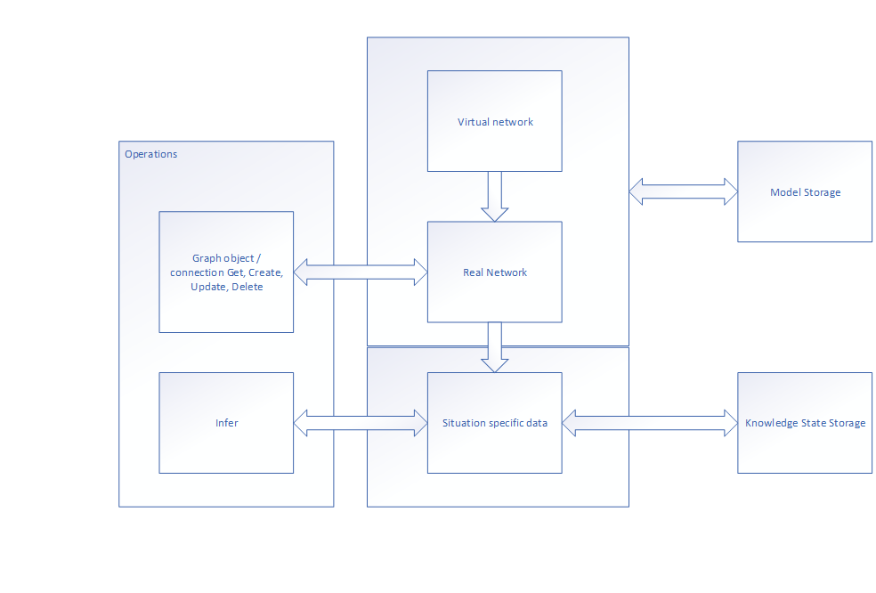

# ThinkBase Architecture

ThinkBase is organized conceptually on several levels.

The Real level generally represents some processing that can be performed on real world objects, since we are principally concerned with knowledge reuse.

The Virtual level represents meta-information about the objects in the Real level.

The lowest level is the Knowledge state. This is a store of specific data for usages of the real level processing.

So, for instance, if the model in the real level contained medical diagnosis rules, the virtual level would contain metadata on the elements in the real level, and the knowledge state would contain individual patient data.

This architecture allows models to be relatively small, and the graph processing to be limited, while offering maximum flexibility.

Both the objects within a graph, and the knowledge states are separately accessible using the API.

