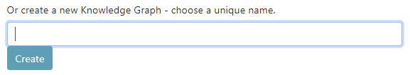
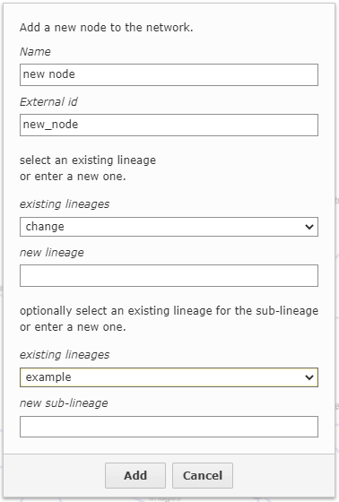
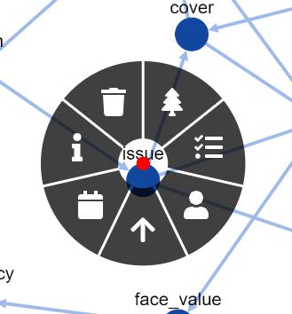
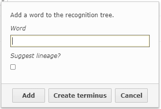
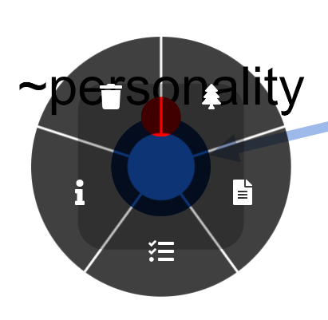

# Getting started

You can create a very simple functioning KG in 5 minutes. 

See the video:

## The process

### Create a new KG

You should chose a unique name for your KG. We normally use the extension _.graph_, but this is your choice. 
Characters should be limited to letters, numbers and the underscore character.

### Add nodes

Clicking on a blank space in the _Real_ tab will allow you to add a new node.
Names are any piece of text. External IDs should be unique and will frequently be a means to link the given node to some external structure.

Lineages are explained in depth [here](ontology.md). Each node can have two, a major and minor lineage. For now think of this as a universal naming system that makes it possible to merge multiple data sources.

A set of default lineages are supplied, and as you add new lineages they will all appear in the existing lineage box.
To create a new lineage put a descriptive word into the new lineage box and select from the choices given in the next step.

### Add attributes to nodes

Right button clicking on a highlighted node will bring up this control.

From 1.00 clockwise, clicking on a segment will:

- View lineage, 
- Edit attributes
- View name
- View External ID
- Edit lifetime
- View help on nodes
- Delete this node

Attributes are data items associated with the node. They have a data type, a lineage, a value and a certainty value.

Attribute types are:

Attributes have lineages too.

### Wire nodes up with connections

Once you have a few nodes you will want to wire them up. Connections are directed in ThinkBase.

Click on the red dot on a source node that will appear as you hover over it and drag the connection to the destination.

A dialog will ask you to name the connection and set a lineage. 

Adding connections is repetitive, so the box will remember the last name and lineage used.

### Create recognition nodes

The design of the ThinkBase chat interface is principally organized to quickly work out what a user wants, and to deliver them to the correct area of the Knowledge Graph.

In other chat systems this is called "intent processing": finding out the user's intent.

A ThinkBase KG has two trees that process text. One is used before and after KG processing, and is at the top level; the other is used while KG processing is ongoing, to offer help or quit a long KG process.

The simplest usage is just to recognize a piece of text or a concept and to fire off the appropriate part of a KG.

To create a recognition node to do this go to the recognition node and click in a blank space.

Enter a word to recognize. Case is ignored. If you click suggest lineage a set of matching lineages will be presented.

Recognition nodes can only have two attributes, a text attribute that defines the response when a node is triggered and a rule attribute that determines the functionality that fires at that time.

### Wire them into the tree

The recognition process handles text by processing each word at the root node. If a concept or text match occurs with one of the children it moves to that, and so on until one or more matches are found that have rules associated with them.

The deepest of these is selected as the intent.

Wire your new node into the tree at the appropriate point by drawing a link as above from the parent to the child. Recognition links are all of one type, so no dialog is required.

### Test 

The conversation tab gives you a way to test the KG. Type in words that will trigger the recognition process and watch what happens.

The JSON to the left records data items as they are collected, and will represent the permanent record of that interaction.

Things to do next:

[Creating an online bot with Microsoft Bot Framework](/bot_frame_tutorial.md)

[Create a Knowledge graph programmatically]()

[Understand lineages](ontology.md)

[Using the ThinkBase 2D UI]()

